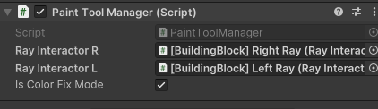
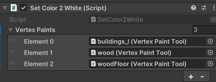
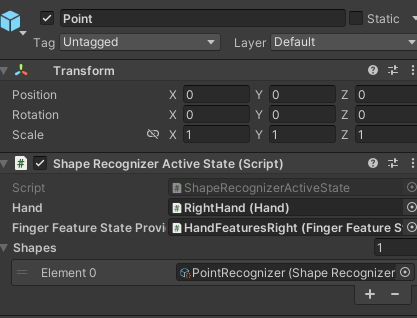

# VRVertexPaintTool

## 概要
Unity + Meta XR SDK環境において、ハンドトラッキングでオブジェクトの頂点カラーを塗るためのスクリプトです。

## 実行例
人指し指で色を塗る設定で動かした場合

https://github.com/user-attachments/assets/8fc44b9f-c433-4ae2-a7a3-ca8ae247e5c8

## 使い方
### PaintToolの使い方
PaintTool.prefabをSceneに置いてから、それぞれの子prefabを設定すれば使えます。

### BrushSetting
Brushの色とサイズを決めれます  
play modeで"Apply Settings"を押さないと反映されません。  

### PaintToolManager
- Meta XR SDKのBuilding Blocksでcamera rigを追加
- PaintToolManagerに、camera rig内のLeftRay、LightRayをアタッチ  
こうすることで、Rayで色塗りできるようになります。  

また、IsColorFixModeをfalseにすると、BrushSettingで指定した色で色塗りできるようになります。  
  

### SetColor2White
色をなくしたいオブジェクトを登録すると、Play Mode時に指定したオブジェクトの色がなくなる。  

### GestureManager
PointをONにすると、人差し指で指さすことで色を塗れるようになります。  
PinchInをONにすると、ピンチインで色を塗れるようになります。  
どちらもOFFにすると、手の形にかかわらず常に色を塗れるようになります。  
使う前に、HandとFingerFeatureStateProviderを次のように設定してください。  

### Tag
色を塗りたいオブジェクトのTagは、Untaggedにしてください。
